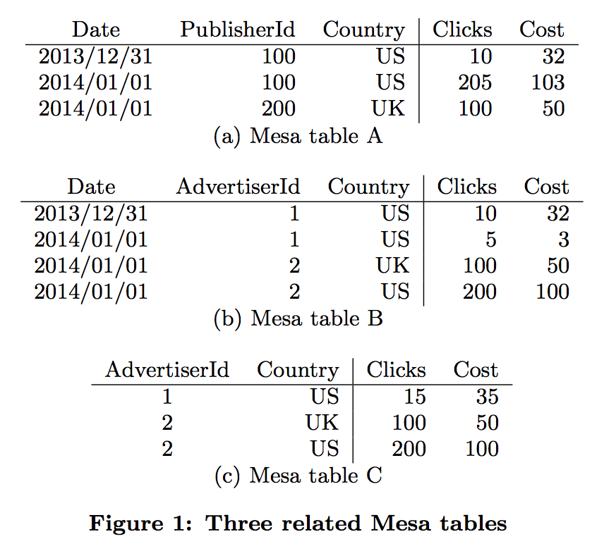
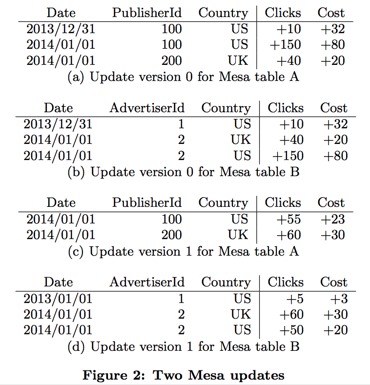

# Mesa: Geo-Replicated, Near Real-Time, Scalable Data Warehousing

##  摘要

**Edit by** <theseusyang@gmail.com>

## 2 Mesa存储子系统

在Mesa系统中的数据是持续生成的, 是Google目前最大和最有价值的数据集之一。对这些数据的分析查询范围横跨简单查询，如“在特定一天某个特定广告商的广告有多少点击率？”，和更复杂的查询应用场景，如"对于特定的广告商, 在十月第一周的8点到11点显示在google.com上来自美国地区的使用移动设备的用户匹配'decaf'的点击量是多少?"

在Mesa系统中数据天生是多维的，通过不同维度展全方位示Google广告平台的微观事实。这些数据主要由两种类型属性组成：多维属性（称之为键）和度量属性（称之为值）。很多维度属性都是层次结构的（甚至是多层次结构等，日期维度能够以日/月/年来组织，也能够以财务的周/季/年来组织），单个事实表可能是多个物化视图聚合而成，这些视图基于这些维度层次结构，使用下钻和上卷来进行数据分析。一个好的数据仓库设计要求单个事实表以任何的方式进行物化和聚合，都能保持一致性。


### 2.1 Mesa数据模型


The key space K and value space V are represented as tuples of columns, each of which has a fixed type (e.g., int32, int64, string, etc.). The schema specifies an associative ag- gregation function for each individual value column, and F is implicitly defined as the coordinate-wise aggregation of the value columns, i.e.:

在Mesa系统中，数据使用表结构来进行维护。每个表有一个用于指定其结构的Schema。特别的是，一个表Schema指定了表的键空间K和相关的值空间V，而K和V都是集合。表的Schema也指定函数F : V x V-> V，用于聚合相同键的所有值。这个聚合函数必须是相关的（例如，对于任意值v0 , v1 , v2 ∈ V，则（F(v0,v1),v2) = F(v0,F(v1,v2)）。实际上，它通常也是满足交换定律的（例如，F(v0,v1) = F(v1,v0)），尽管Mesa确实有非交换聚合函数的表（例如F(v0,v1) = v1来替换一个值）。这个Schema也为一个表指定一个或多个索引，这些索引都是K键的全排序。

键空间K和值空间V使用列的元组表示，每个元组都有一个固定的数据类型（例如，int32、int64、字符串等等）。Schema为每个值列都指定了一个关联的聚合函数，同时 F 作为值列的坐标聚合，被隐式定义，例如：F((x1,...,xk),(y1,...,yk)) = (f1(x1,y1),...,fk(xk,yk))，其中(x1,...,xk),(y1,...,yk) ∈ V是列值的任意两个元组，而且f1...fk是通过Schema为每个值列被显式定义。

举个例子，图1详细展示了Mesa的三个表。所有这三个表都包含了广告点击和成本指标（值列），包含了多种类型的属性，例如点击日期、广告商、显示这个广告的发布站点和国家（键列）。这两个值列的聚合函数都使用的是SUM。假设同一来自底层的事件更新了在这三个表中的数据，那么所有指标在这三个表中是一致的。图1是Mesa表的Schema的一个简化视图。在生产环境中，Mesa包含数千张表，多数表包含数百个列，而且使用不同的聚合函数。


### 2.2 更新和查询

为了达到超高的更新吞吐量，Mesa以批处理的方式进行更新操作。这些批量更新本身是由Mesa外部的上游应用产生的，通常情况下，是以分钟频率产生（更小、更频繁的批处理暗示着更低的更新延时，但更高的资源消耗）。正常来讲，对Mesa的一个更新操作指定一个版本号n（从0开始按顺序分配）和这个表单的行集合（表名、键和值）。每个更新操作对每个（表名，键）最多包含一个聚合值。


一个Mesa查询操作由一个版本号n和在键空间的一个断言P组成。对于每个匹配P的键，此响应包含了一行，这些键出现在版本在0到n的更新中。响应中一个键的值是在这些更新中对于此键的所有值的聚合。Mesa实际上支持更为复杂的查询功能，但是当对原始值进行前处理和后处理时，所有这些都能够被查看。

例如，图2显示了对应于图1中定义的表的两个更新操作，当聚合处理时，生成了表A、B和C。为了维护表的一致性（在2.1章节讨论的），对于这两个表，A和B，每个更新操作都包含一致的行。Mesa自动计算对表C的更新操作，因为它们能从表B的更新中直接衍生过来。理论上，包括AdvertiserId和PublisherId属性的单个更新能够被用于更新所有这三个表，但是这样操作开销比较大，尤其是表中有很多个属性时。

表C对应着一个在表 B 执行SELECT SUM(Clicks), SUM(Cost) GROUP BY AdvertiserId, Country语句的物化视图。这个查询可以直接表示为一个Mesa表，因为在查询中使用SUM函数与对表B的值列使用SUM聚合函数是相互匹配的。对于处理父表的指标列，Mesa使用相同的聚合函数来限制物化视图。

为了实现更新的原子性，Mesa使用多版本控制的方法。Mesa通过版本号按顺序执行更新操作，确保在下一个更新操作前整个合并整个更新是原子性的。而用户对部分合并更新的影响是不可见的。

更新操作的严格顺序有超越原子性以外的应用。在Mesa Schema上的聚合函数可能非交换的，例如在标准的键值存储中，一个键值的更新会完全重写这个键以前的任何值。

更巧妙的是，这种排序约束允许Mesa支持这样的应用场景，不准确的事实通过一个反转动作来表示。特别的是，Google使用在线欺诈检测来确定一个广告点击是否合法。欺诈点击带有负面事实的偏移。例如，有一个图2的更新的版本2，包含着负点击和成本，对应着之前已经处理的广告点击，那么说明是违规的。通过严格的更新排序，Mesa保证了在正面的对应之前，负面事实绝不会被合并。

### 2.3 版本化数据管理

版本化数据在Mesa的更新和查询处理中发挥着至关重要的作用。然而，它也面临着多个挑战。第一，对于给定的广告统计的天然聚合特性，单独保存每个版本从存储的角度来讲成本是非常高的。经过聚合的数据一般来说小得多。第二，在查询时访问所有的版本，同时对它们进行聚合处理也是成本非常高的，而且增加了查询延时。第三，在每次更新时，对所有的版本进行预聚合处理也是成本非常高的。


为了应对这些挑战，Mesa预聚合特定的版本化数据，同时使用Delta操作保存它们，每个版本的数据都由一个行集合（没有重复的键）和一个delta版本（或者更简单地说，一个版本）组成，通过[V1,V2]来表示，V1和V2是更新的版本号，且V1 ≤ V2。我们更倾向于通过版本进行delta处理。在[V1,V2]中的行对应着键的集合，这些键出现在带有 V1和 V2版本号的更新操作中。每个键的值是在这些更新中都是值的聚合。更新操作作为一个单例 delta合并到 Mesa 系统中。对于一个单例，这个delta版本[V1 , V2]对应着带有版本号n的更新，而且n通过V1 = V2 = n来表示。


一个delta[V1, V2]和另一个delta[V2 + 1, V3]能够被聚合来生成delta[V1, V3]，通过简单地合并行键和聚合值的方式。（已经在2.4部分讨论过，在delta中的行通过键进行筛选，因此两个deltas能够以线性时间进行合并。）这个计算的正确性与聚合函数F相关联。值得注意的是，正确性不依赖于F的交换性，而Mesa对于给定的键聚合这两个值，delta版本尝尝以[V1 , V2] 和 [V2 + 1, V3]形式出现，同时聚合是在递增顺序的版本中执行。


Mesa允许用户对一个限定的时间段（例如24小时），在一个特定的版本进行查询。这就意味着在这个时间段前的老版本可以聚合到一个基础delta中（或者简单地说，是一个基点），此基点带有版本[0, B]，对于一些的基础版本来说 B ≥ 0，同时这以后，带有0 ≤ V1 ≤ V2 ≤ B的任何其他deltas[V1, V2]都可以被删除。这个过程称为基点压缩，同时Mesa并发地执行它，而对应的其他操作为异步执行（例如，合并更新和响应查询）。

对于压缩来说，与一个更新版本相关的时间是那个版本生成的时间，它独立于任何在数据条目中的时序信息。例如，在图1中的Mesa表，与2014/01/01关联的数据绝无可能被删除。然而，Mesa可能拒绝对某段时间之后的特定版本的查询。此数据中的日期是是另外一个属性，并且对Mesa系统是不透明。


对于基点合并，为了响应版本号为n的查询，我们能够聚合带有所有单例deltas [B + 1, B + 1]、[B + 2, B + 2],....,[n, n] 的基点delta[0, B]，然后返回所请求的行。即使我们频繁地（例如每天）运行基点扩展，单例的数量仍然能够很容易地达到几百（或者甚至几千），尤其是对于更新密集表时。为了支持更有效的查询操作，Mesa通过一个称为递增压缩的流程，维护了增量 deltas D 集合的表单[U, V]，此表单中 B < U < V。这些增量能够被用于查找增量集合{[0, B]、[B+1, V1]、[V1 +1, V2],....,[Vk +1, n]}, 对于一个版本n，它要求比简单使用单例更少的聚合操作。当然，关于增量delta，也有存储和处理的开销，但这开销是均摊到所有操作中（尤其是查询），使用的是它们的增量而不是单例。

增量合并策略决定了在任意时间点由Mesa维护的 delta 集合。主要目的是平衡由于执行查询所必须做的处理，由于更新合并到一个Mesa delta 中的延时，和与生成和维护 delta 所相关的开销。更具体的说，增量策略决定了：（1）什么delta（单例除外）必须在允许一个更新版本来查询（在更新路径中同步，查询更快的同时拖慢更新）之前生成。（2）什么deltas应该在更新路径外异步地生成。（3）什么时候一个 delta能够被删除。


delta 压缩策略的一个示例是一个双层策略，在图3中详细描述。在这个示例策略下，在任意的时间点有一个基点delta[0, B]，带有版本[B + 1, B + 10]、[B + 1, B + 20]、[B + 1, B + 30]等的增量 deltas，和对于每个大于B的单例 deltas。只要带有版本的B+10x单例被合并，增量的[B+1, B+10x]开始异步生成。一个新的基点 delta[0, B′]几乎每天都会计算，但是新的基点直到与B′相关的对应增量 delta 生成后才能使用。当基点版本B变为B′，这个策略删除旧的基点、旧的增量delta，和所有带有小于或者等于B′版本的单例。然后这个查询涉及到此基点、一个递增和一些单例，并在查询时减少工作量。


Mesa目前在生产环境中使用两层delta策略的一个变种，即使用多层的增量deltas。对于最近的版本，增量deltas 压缩少量单例，对于旧版本增量deltas 压缩了大量的版本。例如，一个delta层次结构可能维护一个基点，然后是带有下面100个版本的delta，然后在这之后带有下面10个版本的delta。对于存储管理，相关的方法使用在其他 append-only 基于日志结构的存储系统，例如LevelDB[2]，BigTable。Mesa基于不同更新的数据维护是一个不同存储Schema[40]的简化采纳，这个 schema 也使用增量视图维护[7, 39, 53]和更新列的读存储[28, 44]。


### 2.4 物理数据和索引格式


Mesa deltas基于增量压缩策略来创建和删除。一旦一个 delta被创建，它是不可修改的，因此对于它的物理格式不需要支持递增修改。

Mesa增量的不可修改性允许它们使用相当简单的物理格式。主要的要求是仅仅是这个格式空间利用率高，作为存储系统这是Mesa的主要成本，而且它必须支持快速索引到一个特定的键，因为一次查询经常包括几个增量的定位和跨键的聚合。为了开启有效的按键定位，每个Mesa表都有一个或多个表索引。每个表索引都有它自己数据的拷贝，它是根据索引顺序来排序的。

这个格式本身的细节是有很多技术环节，所以我们就只关注最重要的方面。增量中的行是按顺序保存在固定大小（为文件系统文件大小限制而优化）的数据文件中。那些行本身组织成行块，每一个行块都是独立地传输和压缩。传输会通过列而不是行来规划数据进行更好的压缩。因为存储是Mesa的主要成本，而在读和查询中解压缩的性能超过写时压缩的性能，在我们选择压缩算法的时候我们强调压缩率和读、解压缩的次数而不是写、压缩的次数。

Mesa也存储和每个数据文件相关的索引文件。（定位每个数据文件对于高层次的表索引是具体的。）一个索引项包含行块的短键（译者注short key），它是这个行块第一个键的固定大小的前缀，和这个数据文件中压缩的行块的偏移量。请求一个特定键的原本算法是在索引文件中的二分查询，它能找到行块可能包含匹配查询键的短键的范围，在对压缩到行块的数据文件进行二分查询后找到想要的键。










