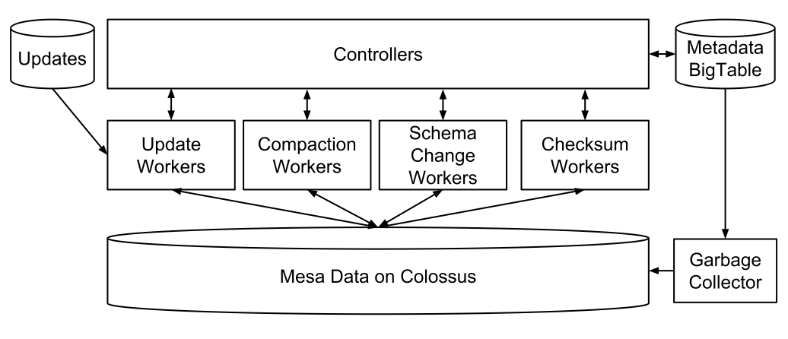
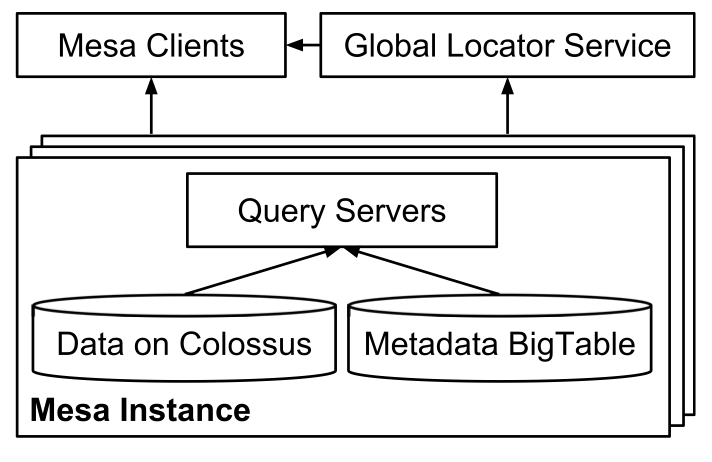
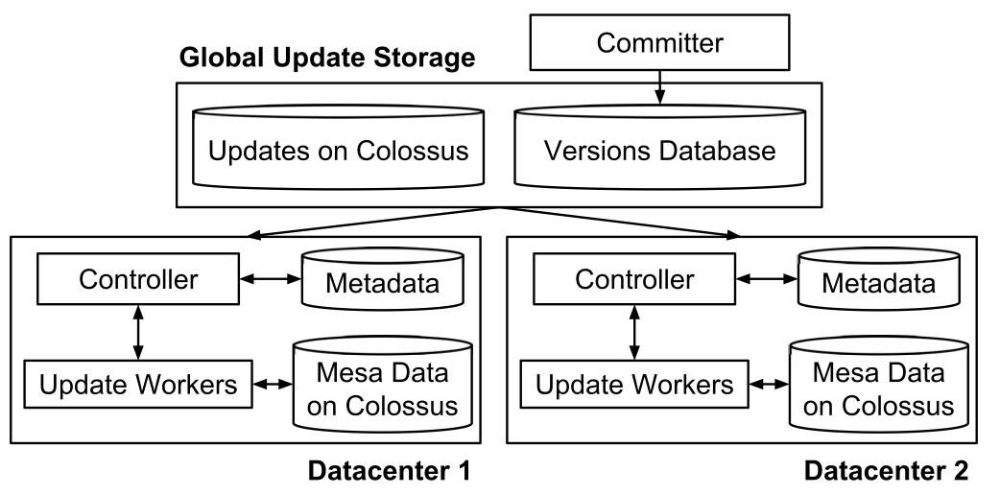

# Mesa: Geo-Replicated, Near Real-Time, Scalable Data Warehousing

## 3 Mesa 系统架构

**Edit by** <theseusyang@gmail.com>

Mesa 使用 Google 内部通用的基础设施和服务构建而来, 其中包括 BigTable [12] 和 Colossus [22, 23]. Mesa 运行在多个数据中心内, 每一个都运行着一个单独实例. 我们从介绍实例的设计开始详解 Mesa 整体结构. 
然后,我们讨论这些实例怎样整合在一起,形成多数据中心部署架构.

### 3.1 单数据中心实例

每个 Mesa 实例由2个子系统构成: 更新/维护和查询.这些子系统是完全松耦合的,允许它们独立扩展.所有的持久化元数据保存在BigTable中,所有的数据文件保存在Colossus中.在数据校正方面,2个子系统中之间没有直接的交互.

####3.1.1 更新/维护子系统

更新和维护子系统执行相关操作来保障本地 Mesa 实例的数据正确性,及时更新和查询的优化.它运行着各种背景操作,例如加载更新,表压缩,Schema变更,以及表的校验和.上述操作都通过称为controller/worker的框架管理和执行,如图4所示.

controller负责调度工作任务,和管理所有的表元数据,元数据保存在BigTable中.表的元数据由每个表的详细状态和操作元数据组成,包括所有 delta文件的条目,与表相关联的更新版本,指定到表的delta压缩策略和当前和以前的操作的描述性条目.

controller可以看作是大规模表的元数据缓存,工作调度器,和工作队列管理器.controller并不执行任何实际的表中数据操作工作.它只负责调度任务和更新元数据.在启动阶段,controller从BigTable中加载表中的元数据,其中包括指定到本地Mesa实例的所有表的条目.对于每个已知的表,它监听表的更新活动,订阅元数据变更.当表从实例中添加或删除时,此订阅会动态更新.新更新的元数据被校验和记录.controller在BigTable中的表元数据上是一个'独占写'进程.

controller 为不同的数据操作类型(关联更新,delta压缩,schema变更和表校验和)维护着相对独立的内部队列.
对于特定的单Mesa实例操作,例如关联更新和delta压缩,controller决定对哪个任务进行排队.对于需要全局协调的应用或全局同步的任务,例如 schema变更和表校验和,通过运行在Mesa实例上下文之外的其他组件进行初始化.对于这些任务,controller通过 RPC 来接收请求工作,并将这些任务加入到相应的内部队列中.

Worker组件负责执行数据操作工作.Mesa为每个任务类型创建一个独立的 worker池,允许每个worker池保持独立扩展.Mesa 使用一个内置的worker池调度器,基于idle worker的可用率来扩展worker的数量.

每个idle worker周期性地轮训controller来请求与worker类型有关的任务,直到发现有效的工作.在接受有效任务之后,worker校验此请求,处理所拿到的任务,当任务执行完毕时通知controller.每个任务都有一个关联的最大拥有时间和一个周期性续租间隔设置来保证一个慢的或死的worker不长时间占用任务.如果上述条件之一不能得到满足,则controller重新分配任务.此操作是安全的,因为controller将只接受来自worker的任务结果.这也保障了Mesa在 worker 故障时是可弹性伸缩的.另外,一个GC持续运行来删除由于worker冲突所留下的垃圾文件. 

controller/worker 框架只被用于更新和维护工作,这些模块可以在不影响外部用户的情况下进行重启.controller 本身也通过table来进行共享, 允许此框架进行扩展. 另外,controller是无状态的 – 所有状态信息在BigTable中维护.这保证了 Mesa对于controller的故障是弹性伸缩的,新的controller能够利用BigTable中的元数据重构Mesa表的状态.

####3.1.2 查询子系统

Mesa的查询子系统由查询服务器组成,如表5所示.这些服务器接受用户查询,检索表的元数据,确定存储相关数据的文件集,执行数据的汇聚操作,再将数据发送到客户端之前,将数据从Mesa内部格式到用户的外部格式.Mesa 查询服务器提供了一个有限的查询引擎,用于支持服务器端的条件过滤和"group by"汇聚查询.上层的数据库引擎,如MySQL [3], F1 [41], 和 Dremel [37]使用Mesa基本数据单元来提供更加丰富的SQL功能,例如join查询.

Mesa客户端有非常宽泛的各种需求和性能要求.在一些应用场景中,Mesa 直接从交互报表前端接受查询,而且有极其严格的低延迟要求.这些查询通常都是短查询,但是需要立即被满足.Mesa 也从大规模的ETL中接受查询,例如离线每日报表,即每天发送数百万的请求和数亿行的检索.这些查询需要高吞吐量,同时不是延时敏感的.Mesa通过在工作负载上进行标记来保障此类延时和吞吐量的需求,然后在查询服务器上以一种隔离和优先机制来使用这些标记.

对于单 Mesa 实例的查询服务器拆分成多个集合,每个服务器集合可服务于所有由controller所管理的表.通过使用查询服务器集合,能够更简单地执行查询服务器的更新,而且能够在相同的Mesa 实例中自动故障切换到另一个集合.在一个集合内部,每个查询服务器原则上能够在任何一个表上处理查询操作.由于性能的原因,Mesa到查询服务器的子集在类似的数据上进行直接查询(例如,在相同表上的所有查询).此技术通过内存预检索和在 Colossus 上进行缓存来达到低延时的保障.在启动阶段,每个查询服务器注册到一个全局的 Locator 服务上,Locator 被用于客户端发现查询服务器.

###3.2 多数据中心部署

Mesa被部署到多个数据中心用于提供高可靠保障.每个实例都是独立的,保存一个单独的数据拷贝.在本章中,我们将讨论Mesa多地域部署的架构.

####3.2.1 一致性更新机制

在 Mesa 中的所有表都是多版本控制的,因此当新的数据更新被处理时,Mesa能够从上一个状态持续提供一致性的数据.一个上游系统以批量的方式生成更新数据,每个几分钟.详情如图6所示,Mesa的提交器负责协调跨多个数据中心的更新,一次一个版本.提交器指定使用新的版本号指定每个批处理更新,同时发布所有与更新绑定的元数据(包含更新数据的文件位置)到版本数据库,它是构建在Paxos [35]一致性算法之上的全局同步和一致性数据存储.提交器自身是无状态的,与运行在多个数据中心内的实例一同保障高可靠性. 

Mesa的控制器监听版本数据库的变更,用以检测新的更新,指定相应的任务到update worker上,同时将成功的更新关联发送回版本数据库.提交器持续评估是否提交标准得到满足(特别是是否更新已经与跨多数据中心的足够多Mesa实例数进行了关联).提交器在更新中跨所有表空间强制执行提交标准.此属性对于维护相关表的一致性是非常有必要的(例如,某个Mesa表是跨另一个Mesa表的物化视图).当提交标准满足时,提交器声明更新的版本号到新提交的版本,在版本数据库中保存这个值.新的查询也作用在新提交的版本上.

Mesa的更新机制设计充分考虑到了对性能的影响.第一,所有新的查询被发布到新提交的版本,同时更新以批量的方式处理,Mesa在查询和更新之间并不需要任何的锁.第二,所有更新数据与不同的Mesa实例之间异步关联,只有元数据同步复制到基于Paxos的版本数据库.因此,这两个属性允许 Mesa同时达到超高吞吐量的查询和更新.

###3.2.2 新建Mesa实例

当Google新建数据中心和淘汰老的数据中心时,我们需要构建全新的Mesa实例.为了启动一个新的Mesa实例,我们使用P2P加载机制.Mesa有一个专门的load worker(与其他的worker类似),从另一个Mesa实例把一张表拷贝到当前实例.在此表用于查询之前,Mesa使用update worker抓取最新提交的版本.在引导启动的过程中,我们加载所有的表到新的Mesa实例中.Mesa也使用相同的P2P加载机制来恢复一张不可用的表.

